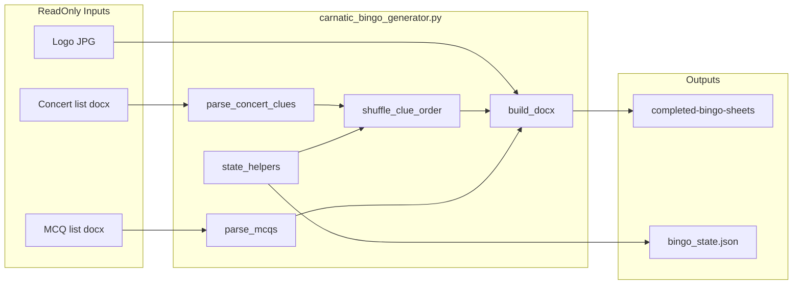

# Implementation Plan: Carnatic Bingo Sheet Generator

**Branch**: `001-carnatic-bingo-generator` | **Date**: 2026-06-03 | **Spec**: [spec.md](spec.md)

## Summary

Build a Python generator that reads concert clues and MCQs from two Word documents, tracks state in `bingo_state.json`, emits a new two-page bingo sheet per run into `completed-bingo-sheets/`, and exposes a `bingo-generator` Cursor/Claude skill for one-command use. Development follows TDD: pytest suite first, implementation second.

## Technical Context

**Language/Version**: Python 3.10+  
**Primary Dependencies**: `python-docx`, `pytest`  
**Storage**: JSON state file + Word output files on disk  
**Testing**: `pytest` with `tmp_path` fixtures for isolated state/output  
**Project Root**: `/Users/willfrasier/Library/CloudStorage/OneDrive-Personal/Documents/Kids/Ashley/coding/2026-Internship/bingo`

## Source Files (read-only at runtime)

| File | Purpose |
|------|---------|
| `Concert list for bingo sheet.docx` | 24 clues |
| `Multiple choice question and answer list.docx` | 20 MCQs |
| `Carnatic_Bingo_Sheet_2 finsihed.docx` | Layout reference only |
| `BrandLogoTJOMWords-SideBySide-WhiteBG.jpg` | Header logo |
| `carnatic_bingo_generator (2).py.txt` | Starting point for layout code |

## Output Layout

| Path | Purpose |
|------|---------|
| `completed-bingo-sheets/Carnatic_Bingo_Sheet_NNN.docx` | Generated sheets |
| `bingo_state.json` | Sheet counter, MCQ index, permutation history, manifest |

## Architecture

### Module split (single file `carnatic_bingo_generator.py`)

- `parse_concert_clues(path) -> list[str]` — 24 strings
- `parse_mcqs(path) -> list[dict]` — question, options, answer
- `load_state` / `save_state` / `next_generation_params` — sheet #, clue order, mcq index (state helpers in same file, not a separate `state.py`)
- `build_bingo_docx(...)` — python-docx layout from existing script
- `main()` — orchestration, CLI entry

## Phases

### Phase 0: Spec Kit + tests (blocking)

- Add `tests/` with conftest fixtures: `tmp_bingo_root`, isolated state path, output dir
- Implement tests against parsers using real source docx paths (read-only)
- State/shuffle/Mcq tests use tmp JSON only

### Phase 1: Core generator

- Promote layout from `carnatic_bingo_generator (2).py.txt`
- Wire parsers and state; logo path → JPG
- Output directory enforcement

### Phase 2: Agent skill

- `.cursor/skills/bingo-generator/SKILL.md`
- Optional `.claude/skills/bingo-generator/SKILL.md` mirror
- `requirements.txt`, `README.md`

## Constraints

- Constitution: TDD, read-only sources, immutable history, live Word parsing
- First automated sheet is **#1** (manual sample #2 is not seeded into state)
- MCQ format on sheet: `□  A) option` (matching finished sample)

## Risk Mitigation

| Risk | Mitigation |
|------|------------|
| Word parsing drift | Integration tests against real docx; clear errors on count mismatch |
| Shuffle exhaustion | Cap retries at 100; error message |
| OneDrive sync delays | Document in README: save/close Word before generating |
